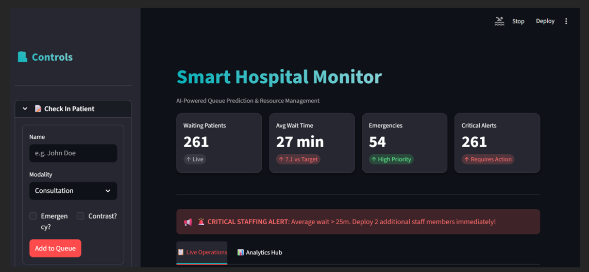
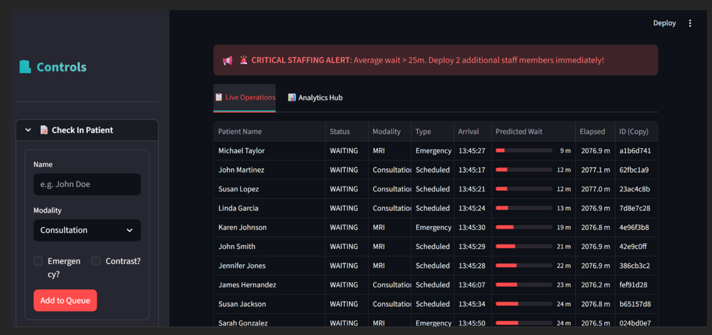
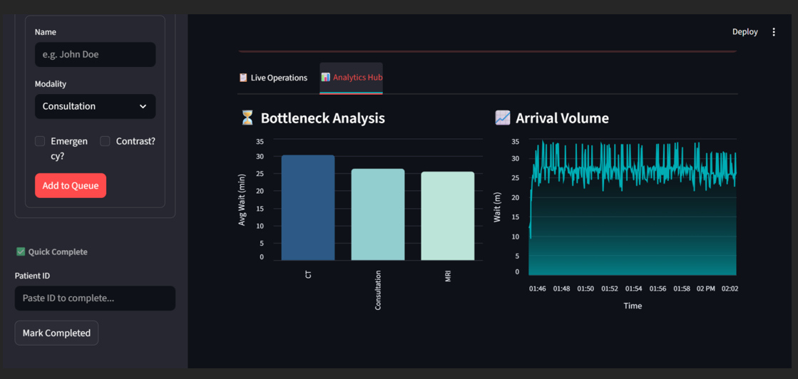
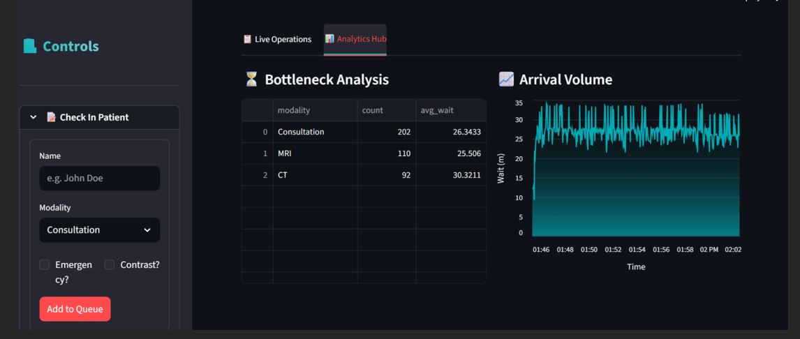
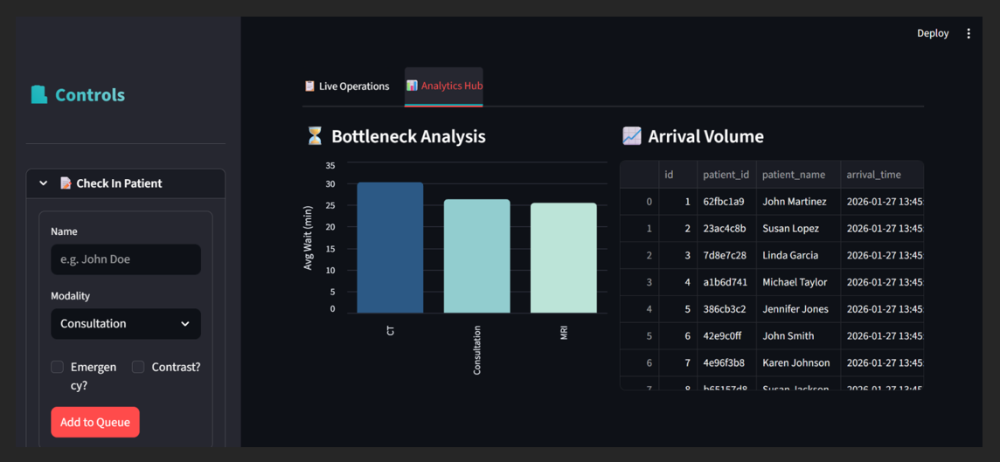

# 🏥 Hospital Flow Optimization

A **Big Data Analytics** solution designed to optimize patient flow in hospital emergency departments using **Python, SQL, Apache Kafka, PySpark, Machine Learning, and Streamlit**. The system processes real-time and historical patient data to predict patient arrivals, identify operational bottlenecks, and support data-driven decision-making for efficient resource allocation.

---

## 📌 Project Overview

Hospital emergency departments often face overcrowding, long waiting times, and inefficient resource utilization. This project provides a scalable analytics solution that combines real-time data streaming with machine learning to improve operational efficiency.

The system integrates multiple technologies to collect, process, analyze, and visualize hospital data, enabling administrators to monitor live operations and make informed decisions.

---

## 🎯 Objectives

- Predict patient arrivals using Machine Learning.
- Analyze emergency department workflow.
- Identify operational bottlenecks.
- Optimize hospital resource allocation.
- Monitor real-time patient flow using Apache Kafka.
- Provide interactive dashboards for decision-making.

---

# 🛠 Tech Stack

| Category | Technologies |
|----------|--------------|
| Programming | Python |
| Database | MySQL |
| Big Data | Apache Kafka, PySpark, Apache Spark |
| Data Processing | Pandas, NumPy |
| Machine Learning | Scikit-learn |
| Dashboard | Streamlit |
| Visualization | Power BI |
| Version Control | Git & GitHub |

---

# 🚀 Key Features

- 📊 Real-time patient monitoring
- 🤖 Machine Learning-based patient arrival prediction
- ⚡ Apache Kafka streaming pipeline
- 📈 Interactive Streamlit dashboards
- 📉 Bottleneck identification
- 🏥 Resource utilization analysis
- 📊 KPI monitoring
- 🗂 Historical data analysis
- 🔄 ETL pipeline implementation
- 📌 Data-driven decision support

---

# 📂 Project Structure

```
Hospital-Flow-Optimization
│
├── Config
├── Data
├── Docs
├── Screenshots
├── Src
├── requirements.txt
├── README.md
└── LICENSE
```

---

# ⚙ System Workflow

1. Patient data is collected from the hospital database.
2. Apache Kafka streams patient records in real time.
3. Data is processed using Python and PySpark.
4. Machine Learning predicts future patient arrivals.
5. Dashboard displays live analytics and KPIs.
6. Hospital administrators monitor operations and optimize resources.

---

# 📸 Dashboard Screenshots

## Smart Hospital Dashboard



---

## Live Operations Dashboard



---

## Analytics Hub



---

## Bottleneck Analysis



---

## Arrival Volume Analysis



---

# 📈 Machine Learning

The project applies Machine Learning techniques to forecast patient arrivals based on historical hospital data.

### Model Workflow

- Data Cleaning
- Feature Engineering
- Model Training
- Model Evaluation
- Patient Arrival Prediction

---

# 📊 Results

- Improved patient arrival forecasting.
- Reduced operational bottlenecks.
- Better resource planning.
- Real-time monitoring using Apache Kafka.
- Interactive dashboards for hospital administrators.

---

# ▶ Installation

Clone the repository

```bash
git clone https://github.com/Alka0987/Hospital-Flow-Optimization.git
```

Move into the project

```bash
cd Hospital-Flow-Optimization
```

Install dependencies

```bash
pip install -r requirements.txt
```

Run the dashboard

```bash
streamlit run dashboard.py
```

---

# 📌 Future Enhancements

- Cloud deployment on AWS/Azure
- Docker containerization
- Deep Learning prediction models
- Real-time alert notifications
- Mobile dashboard integration

---

# 👩‍💻 Author

**Alka Kumari**

- Data Analyst
- Python | SQL | Power BI | PySpark | Apache Kafka | Machine Learning | Streamlit

GitHub:
https://github.com/Alka0987

LinkedIn:
https://www.linkedin.com/in/alka-kumari-999392321/

---


